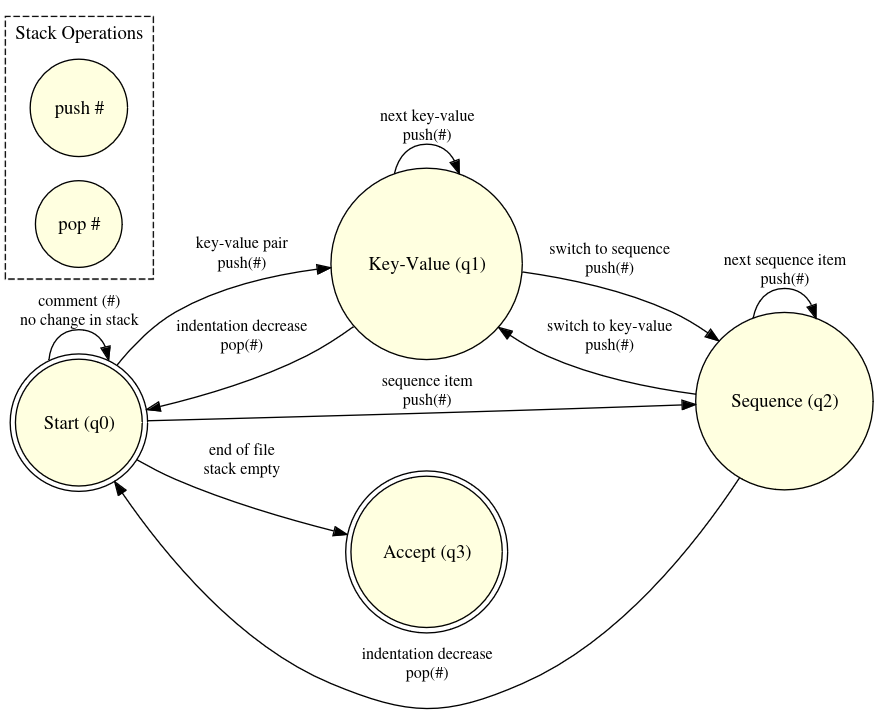

# Yaml-automate
A school project to recognize yaml files with an automate

# Grammaire

```
Document ::= (Directive? DocumentContent Comment?)*
Directive ::= '%' 'YAML' Version
Version ::= Digit '.' Digit
DocumentContent ::= BlockNode | FlowNode
BlockNode ::= BlockMap | BlockSequence
BlockMap ::= (Key Value Comment?)*
Key ::= Scalar
Value ::= Scalar | BlockNode | FlowNode
BlockSequence ::= ('-' Value Comment?)*
FlowNode ::= '{' (Pair (',' Pair)*)? '}' | '[' (Value (',' Value)*)? ']'
Pair ::= Key ':' Value Comment?
Comment ::= '#' .*  
```

# Automate

I have modified this one a little bit to include the recognition of multiline block
and the regexp used are the following:
-     keyValuePattern = /^\s*\w+:\s*(.*)$/;
-     sequenceItemPattern = /^\s*-\s+(.*)$/;
-     multilineStartPattern = /^\s*\w+:\s*[|>]\s*$/;

you can see my automate working in live with your own yaml by running the react application in the yaml-automate folder
(you will need node in a recent version for that)
you can also use the sample yaml to run your tests
```bash
cd yaml-automate
npm start
```

